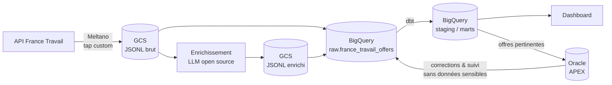

# Observatoire du marché de l'emploi & outil de suivi de recherche

> Pipeline de données de bout en bout sur les offres d'emploi, enrichies par un LLM open source, transformées avec **dbt** sur **BigQuery**, et complétées par une application **Oracle APEX** de validation et de suivi de candidatures.

**Statut : 🚧 en construction** (voir [l'avancement](#avancement))

---

## Pourquoi ce projet

Ce projet a deux objectifs :

1. **Analyser le marché de l'emploi** (compétences demandées, salaires, télétravail, tendances par métier et par région) à partir de données réelles et à jour.
2. **M'outiller dans ma propre recherche d'emploi** : identifier les offres pertinentes pour mes profils, suivre mes candidatures et mesurer mon propre funnel (offres vues → candidatures → entretiens).

Je suis développeur PL/SQL avec 11 ans d'expérience, en transition vers l'**analytics engineering**. Le projet combine donc deux facettes : une plateforme de données moderne (ELT, dbt, tests, documentation) et une application Oracle APEX.

## Questions auxquelles le projet répond

- Quelles compétences sont les plus demandées pour un métier donné, et comment évoluent-elles dans le temps ?
- Quelles sont les fourchettes de salaire par métier, région et niveau d'expérience ?
- Quelle part des offres proposent du télétravail ?
- Quelles offres correspondent le mieux à mes profils (Analytics Engineer, PL/SQL / APEX) ?
- Quel est mon taux de conversion à chaque étape de ma recherche, et quels types d'offres donnent des retours ?

## Architecture



**Principes de conception**
- **Le brut est immuable** : chaque exécution écrit dans un nouveau chemin, ce qui permet de rejouer n'importe quelle étape.
- **BigQuery est la source analytique, Oracle est propriétaire des corrections humaines et du suivi de candidatures.** Un seul système de vérité par type de donnée.
- **Deux environnements isolés** (dev et prod), un projet GCP chacun, mêmes définitions de code, configuration différente.
- **Rien de sensible dans le dépôt, données personnelles cantonnées** : les coordonnées de contact publiées par France Travail (nom de recruteur, e-mail, téléphone) sont conservées dans le brut et extraites en staging pour mon usage personnel, mais exclues dès la couche intermédiaire, donc des marts et de toute vue publique ; mes propres contacts et notes restent dans Oracle.

## Stack technique

| Couche | Outil |
|---|---|
| Extraction | Meltano (tap Singer développé pour l'API France Travail) |
| Stockage brut | Google Cloud Storage (JSONL) |
| Enrichissement | LLM open source exécuté en local (Ollama ou llama.cpp), sorties structurées validées par schéma |
| Entrepôt | BigQuery (région `europe-west1`) |
| Transformation | dbt (moteur Fusion) |
| Application | Oracle Autonomous Database + APEX, PL/SQL |
| Infrastructure | Terraform |
| CI/CD | GitHub Actions, authentification GCP sans clé (Workload Identity Federation) |
| Orchestration | Airflow *(à venir)* |

## Environnements et infrastructure

Deux environnements isolés, **un projet GCP chacun**. Le code est identique, seules les valeurs changent (projet, rétention, garde-fous).

| Aspect | dev | prod |
|---|---|---|
| Rôle | bac à sable jetable, périmètre réduit | données réelles, déploiement sur approbation |
| Rétention du brut | 7 jours | 30 jours |
| Destruction des buckets | autorisée (`force_destroy`) | non |
| Suppression de `meta.state_snapshot` par Terraform | autorisée | bloquée (`deletion_protection`) |
| Déploiement | automatique | approbation manuelle, branche `main` uniquement |

Ce que l'infrastructure crée dans chaque projet :
- 3 buckets GCS : `raw` (brut immuable), `enriched` (sorties du LLM) et `meltano-state` (état de l'extraction incrémentale) ;
- les datasets BigQuery `raw` et `meta`, et en prod ceux des couches dbt (`staging`, `intermediate`, `marts`, `snapshots`) ; en dev et en CI, dbt crée lui-même son dataset unique ;
- 3 service accounts au moindre privilège : `sa-extract`, `sa-dbt`, `sa-enrich` ;
- un service account de déploiement `sa-deployer` et un pool Workload Identity Federation, limités à ce dépôt, à des GitHub Environments précis et, en prod, à la branche `main`.

**Aucune clé JSON** n'existe : en local, j'agis par impersonation de service accounts ; depuis GitHub Actions, l'accès passe par Workload Identity Federation.

### Reproduire la mise en place

Prérequis : un compte GCP avec facturation, `gcloud`, Terraform 1.6 ou plus.

```bash
# 1. Projets, APIs et buckets de state (une seule fois)
export PROJECT_PREFIX="jobboard" SUFFIX="<suffixe-aléatoire>" BILLING_ACCOUNT="<id-facturation>"
./infra/bootstrap/bootstrap.sh

# 2. Plateforme, d'abord en dev
export TF_VAR_user_email="<ton-adresse>"
gcloud auth application-default set-quota-project jobboard-dev-<suffixe>
cd infra/envs/dev && terraform init && terraform plan && terraform apply

# 3. Identités pour la CI (Workload Identity Federation)
cd ../../identity/dev && terraform init && terraform plan && terraform apply
```

Répéter ensuite pour la prod, en changeant le *quota project* de `gcloud` avant chaque environnement.

## Extraction (Meltano)

Un tap Singer développé pour l'API France Travail (authentification OAuth2, pagination, filtrage par mots-clés/région) alimente un run Meltano complet, en **full-refresh** à chaque exécution plutôt qu'en incrémental : l'API ne signale jamais les offres qui disparaissent, donc chaque run donne l'ensemble exact des offres actives à cet instant, ce qui permettra à dbt de déduire en aval quelles offres ont fermé depuis le run précédent.

**Ce que produit un run :**
```
gs://jobboard-<env>-3b375b-raw/france-travail/offers/ingested_at=<INGESTED_AT>/part-<timestamp>.jsonl
```

Chaque enregistrement contient `id`, `dateActualisation`, `_raw` (le payload complet de l'offre, sérialisé en JSON texte), `_extracted_at` et `_ingested_at`.

**Lancer une extraction :**
```bash
export MELTANO_ENVIRONMENT=dev   # ou prod
export GCP_PROJECT_ID="jobboard-${MELTANO_ENVIRONMENT}-3b375b"
export INGESTED_AT=$(date -u +%Y%m%dT%H%M%SZ)

cd extraction
uv sync --frozen && source .venv/bin/activate     # Python et Meltano aux versions figées
meltano --environment="$MELTANO_ENVIRONMENT" install
./run.sh
```

`run.sh` pointe le state Meltano vers le bucket GCS de l'environnement choisi, puis lance `tap-francetravail` → `target-gcs`. Aucune clé n'est nécessaire : l'authentification GCP passe par l'impersonation de `sa-extract` en local, et par Workload Identity Federation une fois exécuté depuis GitHub Actions.

**Décisions prises en cours de route, documentées dans les choix techniques ci-dessous :** `_raw` stocké en chaîne plutôt qu'en objet imbriqué (contourne un bug de sérialisation du target), un seul identifiant de run (`INGESTED_AT`) partagé entre extraction et chargement.

## Chargement (GCS → BigQuery)

`loading/load.sh` charge le contenu d'un run vers `raw.france_travail_offers`, en mode `APPEND` (pas de remplacement de partition : plusieurs runs peuvent avoir lieu la même journée), partitionné par jour sur `_ingested_at`. La table est créée automatiquement au premier chargement, à partir du schéma déclaré dans `loading/schemas/`. Après chaque chargement, `load.sh` positionne `require_partition_filter` : toute requête sur la table doit filtrer `_ingested_at`.

```bash
cd loading && ./load.sh
```

Lit les mêmes variables d'environnement que l'extraction (`GCP_PROJECT_ID`, `INGESTED_AT`) — aucune ne doit être recalculée séparément, pour garantir que le chemin GCS relu correspond exactement à celui que l'extraction vient d'écrire.

**Pipeline complet, orchestré par un unique workflow GitHub Actions planifié** (`.github/workflows/extraction-france-travail.yml`) : génération des identifiants de run → extraction → chargement, une fois par jour, avec `sa-extract` (droits sur `raw` en GCS et en BigQuery).

## Avancement

- [x] Projets GCP dev et prod, bucket de state Terraform (script de bootstrap)
- [x] Plateforme dev en Terraform (buckets, dataset BigQuery `raw`, service accounts, IAM)
- [X] Plateforme prod en Terraform
- [x] Workload Identity Federation pour GitHub Actions (dev puis prod)
- [x] Tap Meltano France Travail (développement, tests, `ruff`, `mypy`)
- [x] Extraction France Travail → GCS (Meltano), state distant, run.sh
- [X] Workflow GitHub Actions planifié (collecte quotidienne)
- [x] Chargement BigQuery (`raw.france_travail_offers`, mode APPEND, partitionné sur `_ingested_at`)
- [ ] Modélisation dbt (staging, marts) et tests *(en cours : snapshot SCD2, staging, `int_offers`, `fct_offers`, `dim_date`)*
- [ ] Premier dashboard
- [ ] CI/CD (lint, plan Terraform, dbt sur pull request)
- [ ] Score de pertinence par règles
- [ ] Application APEX v1 (offres pertinentes, suivi de candidatures)
- [ ] Enrichissement LLM et jeu d'évaluation
- [ ] Synchronisation BigQuery ⇄ Oracle, funnel personnel
- [ ] Orchestration

## Données et conformité

- Source : API *Offres d'emploi* de France Travail, utilisée dans le respect de ses conditions d'utilisation.

## Structure du dépôt

```
infra/          Terraform : bootstrap, modules, envs/ (plateforme) et identity/ (CI), en dev et prod
extraction/     Projet Meltano, tap France Travail, run.sh (point d'entrée de l'extraction)
loading/        Chargement GCS → BigQuery (load.sh, schémas)
dbt/            Projet dbt (snapshot, staging, intermediate, marts)
enrichment/     Enrichissement LLM (à venir)
oracle/         Migrations, packages PL/SQL, application APEX, données fictives (à venir)
orchestration/  Orchestration Airflow (à venir)
.github/        Workflows CI/CD
.continue/      Règles des assistants IA (partagées avec Claude Code) et agent Continue local
```

## Choix techniques et compromis

| Choix | Raison | Alternative écartée |
|---|---|---|
| Un projet GCP par environnement | isolation simple et sûre des données et des droits | un seul projet avec des préfixes |
| Deux environnements (dev, prod) | projet à un seul utilisateur ; des datasets éphémères par pull request et l'approbation de la prod jouent le rôle d'un environnement de test | un troisième environnement de recette |
| Identifiants de projet avec suffixe aléatoire | unicité mondiale exigée par GCP, sans information personnelle | un suffixe lié à mon identité |
| Région unique `europe-west1` | dans l'UE, coût inférieur à la multi-région et à Paris | multi-région `EU`, région américaine (quota gratuit GCS plus large mais moins cohérent avec le RGPD) |
| Terraform avec state distant dans GCS | état partagé entre mon poste et la CI | state local |
| Bucket de state versionné (activé par `bootstrap.sh`) | filet de sécurité quasi gratuit pour un fichier de quelques Ko : un state corrompu ou écrasé se restaure | bucket sans versioning |
| `identity/` séparé de `envs/` | la CI ne peut pas modifier sa propre porte d'entrée, et détruire le dev n'entraîne pas la perte du pool WIF | tout dans un seul state |
| `deletion_protection` sur `meta.state_snapshot` hors dev | la table porte le marqueur du dernier jour snapshoté ; perdue lors d'un destroy ou d'un remplacement (changement de schéma), le snapshot suivant repartirait de la plus ancienne partition du brut et fausserait l'historique | `prevent_destroy` (n'accepte pas de variable, bloquerait aussi le dev), aucune protection |
| Impersonation et Workload Identity Federation | aucune clé JSON à stocker ou à faire tourner, jetons de courte durée | clés de service accounts |
| Branche `main` imposée côté GCP en prod (`attribute_condition` du provider WIF), en plus de la règle de branche des GitHub Environments | défense en profondeur : si la règle GitHub est retirée ou mal configurée, un job lancé depuis une autre branche reste refusé par GCP dès l'échange de token. Le filtre est porté par le provider plutôt que par les bindings, car chaque environnement a son propre pool : une seule condition, sans nouveau mapping d'attribut. Le dev reste ouvert à toutes les branches pour valider un workflow avant le merge | seule la règle de branche de GitHub, filtre `attribute.ref` dans chaque binding `principalSet` |
| Un service account par usage | moindre privilège : l'extraction ne peut pas modifier les modèles, dbt ne peut pas écraser le brut | un compte unique |
| `sa-dbt` : `bigquery.user` sur le projet, droits sur les données accordés dataset par dataset (lecture sur `raw`, écriture sur `meta` et les couches de prod) | `bigquery.user` permet de lancer des requêtes et de créer un dataset sans accès aux données ; le créateur devient propriétaire de son dataset, ce qui suffit en dev (`analytics`) et en CI (`pr_<n>`). dbt ne peut donc ni modifier ni supprimer le brut | `dataEditor` sur le projet (écriture sur tous les datasets, dont `raw`) |
| `sa-deployer` administrateur de fait de son projet (`projectIamAdmin`, `serviceAccountAdmin` et `storage.admin` au niveau projet) | Terraform gère l'IAM du projet et des service accounts : un compte qui accorde des rôles peut se les accorder, et une restriction sur l'un de ces rôles se contourne par un autre. Le contrôle porte donc sur qui peut l'utiliser : WIF limité à ce dépôt et, en prod, à l'Environment `prod` avec approbation manuelle ; `identity/` reste hors de portée de la CI. Limite : la vraie barrière est cette approbation, pas le périmètre IAM | condition IAM limitant les rôles accordables (à étendre à `serviceAccountAdmin`, liste à mettre à jour à chaque nouveau rôle de `data_platform` puis à appliquer à la main dans `identity/prod`) |
| LLM exécuté en local | aucun coût GPU cloud, données non envoyées à un prestataire | Cloud Run avec GPU, Vertex AI |
| Filtre par mots-clés à l'API, une liste par environnement (réduite en dev) | volume limité et ciblé sur mes deux profils (Analytics Engineer, PL/SQL) ; la classification fine reste en aval. Limite : 3 150 résultats max par requête, une requête trop large fait échouer le run et doit être découpée | extraction de tout le domaine informatique (élargissable plus tard) |
| Échec du run dès qu'une requête dépasse 3 150 résultats (total lu dans `Content-Range`) | une requête tronquée fausserait le snapshot dbt (offres non lues marquées closes) ; mieux vaut une journée de collecte perdue, visible et rattrapable, qu'un résultat partiel silencieux | avertissement dans les logs et lecture jusqu'à l'index 3149 (troncature invisible tant que le run est vert) |
| Pas de Secret Manager au départ | limiter la surface et les coûts ; les secrets sont dans les GitHub Environments | Secret Manager (à activer si le besoin apparaît) |
| GitHub Actions planifié avant Airflow | suffisant pour une collecte quotidienne, sans infrastructure | Cloud Composer (coût élevé pour ce volume) |
| Extraction en full-refresh, sans incrémental | l'API ne signale pas les offres fermées ; seul un instantané complet à chaque run permet à dbt de déduire les fermetures | incrémental sur `dateActualisation` (aurait manqué les fermetures) |
| `_raw` sérialisé en chaîne JSON dans le tap | contourne un bug du target retenu (`Decimal` non sérialisable par sa bibliothèque JSON) sans en dépendre pour un correctif | forker le target pour corriger sa sérialisation (dette technique sur une dépendance à 2 étoiles, non maintenue) |
| Un seul identifiant de run (`INGESTED_AT`), généré une fois par l'appelant, partagé entre extraction et chargement | élimine tout risque de divergence entre le chemin GCS écrit et celui relu (notamment autour de minuit) ; `run.sh` et `load.sh` valident sa présence plutôt que de le recalculer | `run_id` et date calculés séparément dans chaque script |
| `run.sh` et `load.sh` comme points d'entrée uniques | même commande testée en local, appelée par le CI puis plus tard par Airflow, sans dupliquer la logique | commandes Meltano/bq écrites directement dans le YAML du workflow |
| `_raw` chargé en `STRING`, `PARSE_JSON` réservé à la couche staging dbt | BigQuery ne convertit pas une chaîne JSON-encodée en type `JSON` structuré au chargement ; garder `_raw` en chaîne évite de réintroduire le bug de sérialisation `Decimal` | déclarer `_raw` en type `JSON` (aucun gain sans objet non échappé en source) |
| Chargement en mode `APPEND`, dédoublonnage laissé à dbt | plusieurs runs peuvent avoir lieu la même journée ; un remplacement de partition aurait écrasé les runs précédents du même jour | `--replace` sur la partition du jour (idempotent par jour, mais pas par run) |
| `require_partition_filter` sur `raw.france_travail_offers`, positionné par un `bq update` dans `load.sh` après chaque chargement ; freshness de la source et tests de source filtrés sur les 7 derniers jours | la table croît d'un instantané complet par jour : une requête qui oublie le filtre sur `_ingested_at` lirait `_raw` sur tout l'historique. L'option rend ce scan impossible au lieu de compter sur la discipline. Le `bq update`, idempotent et gratuit, couvre les tables déjà créées (le flag de `bq load` ne vaut qu'à la création) et s'applique à la prod par la collecte en CI. La freshness reste mesurée sur l'identifiant du run et ne lit que la colonne `_ingested_at` | freshness par métadonnées (date de modification de la table, déplacée aussi par le `bq update`), `ALTER TABLE` ponctuel (opération manuelle en prod, perdue si la table est recréée), table gérée par Terraform, pas d'option (tests de source sur tout l'historique de `_raw` à chaque build) |
| Garde-fou du snapshot dans la macro qui choisit le jour à traiter, avec un seuil de volume relatif au jour précédent (`france_travail_offers_min_volume_ratio`) | `hard_deletes: invalidate` clôt toute offre absente de la source : un jour vide ou partiel fermerait à tort des milliers d'offres dans un historique irremplaçable. Le contrôle s'exécute avec `dbt snapshot` seul, sans test à lancer avant, et le ratio suit le volume du marché sans réglage | test dbt de volume sur la source (non exécuté par `dbt snapshot`), seuil absolu en `var` (à réajuster quand le marché ou `search_queries` évolue) |
| Snapshot en stratégie `check` sur `dateActualisation`, toutes ses bornes datées au jour d'ingestion traité (surcharge de `snapshot_get_time`) | une seule horloge, croissante d'un run à l'autre : les marqueurs incrémentaux de `stg_` et `fct_offers` restent fiables, une offre rouverte ne chevauche pas sa clôture, et une clôture porte le jour d'ingestion même en rattrapage. Une version est créée dès que `dateActualisation` change, même si elle recule | stratégie `timestamp` (versions datées par la source : versions perdues par les marqueurs, périodes qui se chevauchent), périodes recalculées dans un staging reconstruit à chaque run (`_raw` relu en entier, perte de l'incrémental) |
| `fct_offers` sous contrat (`contract: enforced`) avec liste de colonnes explicite, en gardant `on_schema_change='append_new_columns'` | le schéma du mart est décidé dans son YAML : une colonne ajoutée dans `int_offers` n'y entre pas sans modification du SQL et du contrat, et le build échoue sur un écart de type ou de nom. `append_new_columns` permet ensuite d'ajouter au mart une colonne déclarée sans le reconstruire | `SELECT *` sans contrat (schéma modifié en silence), `on_schema_change='fail'` (chaque ajout de colonne imposerait un `--full-refresh`) |
| `stg_france_travail__offers` et `fct_offers` partitionnés par mois sur `_valid_to`, cible du `merge` restreinte à `_valid_to IS NULL` (`incremental_predicates`) | le `merge` n'insère que des versions nouvelles et ne met à jour que des versions encore ouvertes (fermetures) : il ne lit que la partition des offres actives, et son coût ne croît plus avec l'historique. Une fermeture déplace la ligne dans la partition de son mois. Les lectures des offres actives n'ouvrent qu'une partition | partition sur `_valid_from` (une fermeture d'offre ancienne sort de toute fenêtre de filtre et devient un doublon ; sans filtre, la cible est lue en entier), `insert_overwrite` (la source ne contient que les lignes modifiées : réécrire une partition effacerait les autres), partition par jour (partitions de quelques Ko) |
| Snapshot partitionné par mois sur `dbt_valid_to`, marqueurs de `stg_` lus par `run_query` et injectés en littéraux | la comparaison du snapshot ne porte que sur les versions ouvertes, et `stg_` ne lit plus que celles-ci et le mois en cours : le coût suit le stock d'offres actives, plus l'historique de `_raw`. Une sous-requête dans le filtre empêche l'élagage. Le `MERGE` du snapshot lit encore toute la table (filtre hors du `ON` dans Fusion). Migration par copie : partitionnement impossible sur une table existante, contenu identique sans rejeu | sous-requête sur `{{ this }}` (snapshot lu en entier à chaque run), partition par jour (élagage plus fin, partitions minuscules, incohérent avec `stg_`), migration par rejeu jour par jour (dépend de la rétention du brut, un run par jour) |
| Coordonnées de contact gardées en staging, exclues à partir de `int_offers` | utiles pour postuler (usage personnel), sans fuite vers les marts ou un dashboard public | masquage dès l'extraction (perte d'une information utile) |
| `sa-extract` gère aussi le chargement BigQuery | droits déjà accordés sur `raw` dès la mise en place de la plateforme ; ce compte est responsable de toute la zone d'atterrissage, pas seulement du fichier GCS | un service account de chargement séparé |
| Toutes les dépendances de la collecte figées : Python et Meltano par `uv.lock`, plugins par SHA ou version exacte dans `pip_url`, leurs dépendances transitives par un fichier de contraintes (`extraction/constraints/`), `dbt_utils` en version exacte | la collecte de prod tourne seule chaque jour avec accès à GCS et BigQuery : une version publiée en amont (casse ou paquet compromis) ne doit pas l'atteindre sans passer par une PR. Coût : régénérer locks et contraintes à chaque montée de version | versions flottantes ou plages (casse possible sans changement du dépôt), figer le seul niveau direct (dépendances transitives toujours flottantes) |
| Collectes sérialisées dans un groupe `concurrency` unique, tous environnements et branches confondus, avec `cancel-in-progress: false` et `queue: max` | dev et prod partagent une seule clé d'API France Travail, donc un même quota. Un run en attente démarre après le précédent au lieu de l'interrompre : annuler une collecte peut laisser des fichiers partiels dans GCS ou un state Meltano à moitié écrit. Limite : un run dev lancé vers 05:00 UTC retarde la collecte de prod | un groupe par environnement (deux runs simultanés sur la même clé), annulation du run en cours |
| Règles des assistants IA dans `.continue/rules/`, `.claude/rules` en lien symbolique, `AGENTS.md` à la racine importé par `CLAUDE.md` | une seule source lue nativement par Claude Code et Continue (LLM local) ; chaque règle porte `paths:` et `globs:` pour n'être chargée que sur son périmètre | `uses:` dans l'agent Continue (chemins relatifs cassés par un bug de Continue), un CLAUDE.md par sous-dossier (ignoré par Continue) |

**Laissé de côté volontairement :** environnement de recette, orchestrateur managé, GPU cloud, Secret Manager.

**Garde-fous de coût :** alerte de budget GCP, plafond `maximum_bytes_billed` sur les requêtes dbt de dev et de CI, quota quotidien BigQuery, rétention limitée du brut en dev.

**Coût mensuel constaté :** *à compléter après quelques semaines d'exploitation.*

## Auteur

Nicolas Fleurentin · [LinkedIn](https://www.linkedin.com/in/nicolasfleurentin/)
