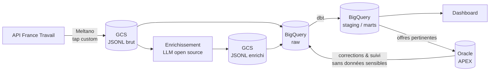

# Observatoire du marché de l'emploi & outil de suivi de recherche

> Pipeline de données de bout en bout sur les offres d'emploi, enrichies par un LLM open source, transformées avec **dbt** sur **BigQuery**, et complétées par une application **Oracle APEX** de validation et de suivi de candidatures.

**Statut : 🚧 en construction** (voir [l'avancement](#avancement))

---

## Pourquoi ce projet

Ce projet a deux objectifs :

1. **Analyser le marché de l'emploi** (compétences demandées, salaires, télétravail, tendances par métier et par région) à partir de données réelles et à jour.
2. **M'outiller dans ma propre recherche d'emploi** : identifier les offres pertinentes pour mes profils, suivre mes candidatures et mesurer mon propre funnel (offres vues → candidatures → entretiens).

Je suis développeur PL/SQL avec 11 ans d'expérience, en transition vers l'**analytics engineering**. Le projet combine donc deux facettes : une plateforme de données moderne (ELT, dbt, tests, documentation) et une application Oracle APEX.

## Questions auxquelles le projet répond

- Quelles compétences sont les plus demandées pour un métier donné, et comment évoluent-elles dans le temps ?
- Quelles sont les fourchettes de salaire par métier, région et niveau d'expérience ?
- Quelle part des offres proposent du télétravail ?
- Quelles offres correspondent le mieux à mes profils (Analytics Engineer, PL/SQL / APEX) ?
- Quel est mon taux de conversion à chaque étape de ma recherche, et quels types d'offres donnent des retours ?

## Architecture



**Principes de conception**
- **Le brut est immuable** : chaque exécution écrit dans un nouveau chemin, ce qui permet de rejouer n'importe quelle étape.
- **BigQuery est la source analytique, Oracle est propriétaire des corrections humaines et du suivi de candidatures.** Un seul système de vérité par type de donnée.
- **Deux environnements isolés** (dev et prod), un projet GCP chacun, mêmes définitions de code, configuration différente.
- **Rien de sensible dans le dépôt ni dans BigQuery** : les données personnelles des recruteurs sont masquées dès l'extraction, et mes contacts et notes restent dans Oracle.

## Stack technique

| Couche | Outil |
|---|---|
| Extraction | Meltano (tap Singer développé pour l'API France Travail) |
| Stockage brut | Google Cloud Storage (JSONL) |
| Enrichissement | LLM open source, sorties structurées validées par schéma |
| Entrepôt | BigQuery (région `europe-west1`) |
| Transformation | dbt |
| Application | Oracle Autonomous Database + APEX, PL/SQL |
| Infrastructure | Terraform |
| CI/CD | GitHub Actions |
| Orchestration | Airflow *(à venir)* |

## Avancement

- [ ] Infrastructure dev et prod (Terraform, Workload Identity Federation)
- [ ] Extraction France Travail → GCS (Meltano)
- [ ] Chargement BigQuery
- [ ] Modélisation dbt (staging, marts) et tests
- [ ] Premier dashboard
- [ ] CI/CD (lint, plan Terraform, dbt sur pull request)
- [ ] Score de pertinence par règles
- [ ] Application APEX v1 (offres pertinentes, suivi de candidatures)
- [ ] Enrichissement LLM et jeu d'évaluation
- [ ] Synchronisation BigQuery ⇄ Oracle, funnel personnel
- [ ] Orchestration

## Données et conformité

- Source : API *Offres d'emploi* de France Travail, utilisée dans le respect de ses conditions d'utilisation.

## Structure du dépôt

```
infra/          Terraform (modules et environnements dev / prod)
extraction/     Projet Meltano et tap France Travail
loading/        Chargement GCS → BigQuery
dbt/            Projet dbt
oracle/         Migrations, packages PL/SQL, application APEX, données fictives
.github/        Workflows CI/CD
```

## Choix techniques et compromis


## Auteur

Nicolas Fleurentin · [LinkedIn](https://www.linkedin.com/in/nicolasfleurentin/)
