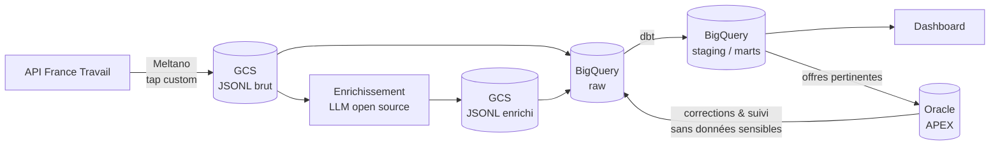

# Observatoire du marché de l'emploi & outil de suivi de recherche

> Pipeline de données de bout en bout sur les offres d'emploi, enrichies par un LLM open source, transformées avec **dbt** sur **BigQuery**, et complétées par une application **Oracle APEX** de validation et de suivi de candidatures.

**Statut : 🚧 en construction** (voir [l'avancement](#avancement))

---

## Pourquoi ce projet

Ce projet a deux objectifs :

1. **Analyser le marché de l'emploi** (compétences demandées, salaires, télétravail, tendances par métier et par région) à partir de données réelles et à jour.
2. **M'outiller dans ma propre recherche d'emploi** : identifier les offres pertinentes pour mes profils, suivre mes candidatures et mesurer mon propre funnel (offres vues → candidatures → entretiens).

Je suis développeur PL/SQL avec 11 ans d'expérience, en transition vers l'**analytics engineering**. Le projet combine donc deux facettes : une plateforme de données moderne (ELT, dbt, tests, documentation) et une application Oracle APEX.

## Questions auxquelles le projet répond

- Quelles compétences sont les plus demandées pour un métier donné, et comment évoluent-elles dans le temps ?
- Quelles sont les fourchettes de salaire par métier, région et niveau d'expérience ?
- Quelle part des offres proposent du télétravail ?
- Quelles offres correspondent le mieux à mes profils (Analytics Engineer, PL/SQL / APEX) ?
- Quel est mon taux de conversion à chaque étape de ma recherche, et quels types d'offres donnent des retours ?

## Architecture



**Principes de conception**
- **Le brut est immuable** : chaque exécution écrit dans un nouveau chemin, ce qui permet de rejouer n'importe quelle étape.
- **BigQuery est la source analytique, Oracle est propriétaire des corrections humaines et du suivi de candidatures.** Un seul système de vérité par type de donnée.
- **Deux environnements isolés** (dev et prod), un projet GCP chacun, mêmes définitions de code, configuration différente.
- **Rien de sensible dans le dépôt ni dans BigQuery** : les données personnelles des recruteurs sont masquées dès l'extraction, et mes contacts et notes restent dans Oracle.

## Stack technique

| Couche | Outil |
|---|---|
| Extraction | Meltano (tap Singer développé pour l'API France Travail) |
| Stockage brut | Google Cloud Storage (JSONL) |
| Enrichissement | LLM open source exécuté en local (Ollama ou llama.cpp), sorties structurées validées par schéma |
| Entrepôt | BigQuery (région `europe-west1`) |
| Transformation | dbt (moteur Fusion) |
| Application | Oracle Autonomous Database + APEX, PL/SQL |
| Infrastructure | Terraform |
| CI/CD | GitHub Actions, authentification GCP sans clé (Workload Identity Federation) |
| Orchestration | Airflow *(à venir)* |

## Environnements et infrastructure

Deux environnements isolés, **un projet GCP chacun**. Le code est identique, seules les valeurs changent (projet, rétention, garde-fous).

| Aspect | dev | prod |
|---|---|---|
| Rôle | bac à sable jetable, périmètre réduit | données réelles, déploiement sur approbation |
| Rétention du brut | 7 jours | 30 jours |
| Destruction des buckets | autorisée (`force_destroy`) | non |
| Déploiement | automatique | approbation manuelle, branche `main` uniquement |

Ce que l'infrastructure crée dans chaque projet :
- 3 buckets GCS : `raw` (brut immuable), `enriched` (sorties du LLM) et `meltano-state` (état de l'extraction incrémentale) ;
- le dataset BigQuery `raw` (dbt crée ses propres datasets) ;
- 3 service accounts au moindre privilège : `sa-extract`, `sa-dbt`, `sa-enrich` ;
- un service account de déploiement `sa-deployer` et un pool Workload Identity Federation, limités à ce dépôt et à des GitHub Environments précis.

**Aucune clé JSON** n'existe : en local, j'agis par impersonation de service accounts ; depuis GitHub Actions, l'accès passe par Workload Identity Federation.

### Reproduire la mise en place

Prérequis : un compte GCP avec facturation, `gcloud`, Terraform 1.6 ou plus.

```bash
# 1. Projets, APIs et buckets de state (une seule fois)
export PROJECT_PREFIX="jobboard" SUFFIX="<suffixe-aléatoire>" BILLING_ACCOUNT="<id-facturation>"
./infra/bootstrap/bootstrap.sh

# 2. Plateforme, d'abord en dev
export TF_VAR_user_email="<ton-adresse>"
gcloud auth application-default set-quota-project jobboard-dev-<suffixe>
cd infra/envs/dev && terraform init && terraform plan && terraform apply

# 3. Identités pour la CI (Workload Identity Federation)
cd ../../identity/dev && terraform init && terraform plan && terraform apply
```

Répéter ensuite pour la prod, en changeant le *quota project* de `gcloud` avant chaque environnement.

## Extraction (Meltano)

Un tap Singer développé pour l'API France Travail (authentification OAuth2, pagination, filtrage par mots-clés/région) alimente un run Meltano complet, en **full-refresh** à chaque exécution plutôt qu'en incrémental : l'API ne signale jamais les offres qui disparaissent, donc chaque run donne l'ensemble exact des offres actives à cet instant, ce qui permettra à dbt de déduire en aval quelles offres ont fermé depuis le run précédent.

**Ce que produit un run :**
```
gs://jobboard-<env>-3b375b-raw/france-travail/offers/ingestion_date=YYYY-MM-DD/run_id=<RUN_ID>/part-<timestamp>.jsonl
```

Chaque enregistrement contient `id`, `dateActualisation`, `_raw` (le payload complet de l'offre, sérialisé en JSON texte), `_extracted_at` et `_run_id`.

**Lancer une extraction :**
```bash
cd extraction
./run.sh dev    # ou prod
```

Le script fixe un `run_id`, pointe le state Meltano vers le bucket GCS de l'environnement choisi, puis lance `tap-francetravail` → `target-gcs`. Aucune clé n'est nécessaire : l'authentification GCP passe par l'impersonation de `sa-extract` en local, et par Workload Identity Federation une fois exécuté depuis GitHub Actions.

**Décisions prises en cours de route, documentées dans les choix techniques ci-dessous :** `_raw` stocké en chaîne plutôt qu'en objet imbriqué (contourne un bug de sérialisation du target).

## Avancement

- [x] Projets GCP dev et prod, bucket de state Terraform (script de bootstrap)
- [x] Plateforme dev en Terraform (buckets, dataset BigQuery `raw`, service accounts, IAM)
- [X] Plateforme prod en Terraform
- [x] Workload Identity Federation pour GitHub Actions (dev puis prod)
- [x] Tap Meltano France Travail (développement)
- [x] Extraction France Travail → GCS (Meltano), state distant, run.sh
- [X] Workflow GitHub Actions planifié (collecte quotidienne)
- [ ] Chargement BigQuery
- [ ] Modélisation dbt (staging, marts) et tests
- [ ] Premier dashboard
- [ ] CI/CD (lint, plan Terraform, dbt sur pull request)
- [ ] Score de pertinence par règles
- [ ] Application APEX v1 (offres pertinentes, suivi de candidatures)
- [ ] Enrichissement LLM et jeu d'évaluation
- [ ] Synchronisation BigQuery ⇄ Oracle, funnel personnel
- [ ] Orchestration

## Données et conformité

- Source : API *Offres d'emploi* de France Travail, utilisée dans le respect de ses conditions d'utilisation.

## Structure du dépôt

```
infra/          Terraform : bootstrap, modules, envs/ (plateforme) et identity/ (CI), en dev et prod
extraction/     Projet Meltano, tap France Travail, run.sh (point d'entrée de l'extraction)
loading/        Chargement GCS → BigQuery
dbt/            Projet dbt
oracle/         Migrations, packages PL/SQL, application APEX, données fictives
.github/        Workflows CI/CD
```

## Choix techniques et compromis

| Choix | Raison | Alternative écartée |
|---|---|---|
| Un projet GCP par environnement | isolation simple et sûre des données et des droits | un seul projet avec des préfixes |
| Deux environnements (dev, prod) | projet à un seul utilisateur ; des datasets éphémères par pull request et l'approbation de la prod jouent le rôle d'un environnement de test | un troisième environnement de recette |
| Identifiants de projet avec suffixe aléatoire | unicité mondiale exigée par GCP, sans information personnelle | un suffixe lié à mon identité |
| Région unique `europe-west1` | dans l'UE, coût inférieur à la multi-région et à Paris | multi-région `EU`, région américaine (quota gratuit GCS plus large mais moins cohérent avec le RGPD) |
| Terraform avec state distant dans GCS | état partagé entre mon poste et la CI | state local |
| Bucket de state sans versioning | fichier de quelques Ko, choix assumé pour un projet personnel (activable plus tard) | versioning activé, filet de sécurité peu coûteux |
| `identity/` séparé de `envs/` | la CI ne peut pas modifier sa propre porte d'entrée, et détruire le dev n'entraîne pas la perte du pool WIF | tout dans un seul state |
| Impersonation et Workload Identity Federation | aucune clé JSON à stocker ou à faire tourner, jetons de courte durée | clés de service accounts |
| Un service account par usage | moindre privilège : l'extraction ne peut pas modifier les modèles, dbt ne peut pas écraser le brut | un compte unique |
| LLM exécuté en local | aucun coût GPU cloud, données non envoyées à un prestataire | Cloud Run avec GPU, Vertex AI |
| Extraction du domaine informatique, classification en aval | permet de suivre deux profils (Analytics Engineer, PL/SQL) et de changer la définition de « data » sans réextraire | filtre par mots-clés à l'API |
| Pas de Secret Manager au départ | limiter la surface et les coûts ; les secrets sont dans les GitHub Environments | Secret Manager (à activer si le besoin apparaît) |
| GitHub Actions planifié avant Airflow | suffisant pour une collecte quotidienne, sans infrastructure | Cloud Composer (coût élevé pour ce volume) |
| Extraction en full-refresh, sans incrémental | l'API ne signale pas les offres fermées ; seul un instantané complet à chaque run permet à dbt de déduire les fermetures | incrémental sur `dateActualisation` (aurait manqué les fermetures) |
| `_raw` sérialisé en chaîne JSON dans le tap | contourne un bug du target retenu (`Decimal` non sérialisable par sa bibliothèque JSON) sans en dépendre pour un correctif | forker le target pour corriger sa sérialisation (dette technique sur une dépendance à 2 étoiles, non maintenue) |
| `run_id` porté à la fois par le chemin GCS et par un champ de chaque enregistrement | traçabilité d'un run même après agrégation ou copie des données, indépendante du nom de fichier | `run_id` uniquement dans le nom de fichier |
| `run.sh` comme point d'entrée unique de l'extraction | même commande testée en local, appelée par le CI puis plus tard par Airflow, sans dupliquer la logique | commandes Meltano écrites directement dans le YAML du workflow |

**Laissé de côté volontairement :** environnement de recette, orchestrateur managé, GPU cloud, Secret Manager.

**Garde-fous de coût :** alerte de budget GCP, plafond `maximum_bytes_billed` sur les requêtes dbt de dev et de CI, quota quotidien BigQuery, rétention limitée du brut en dev.

**Coût mensuel constaté :** *à compléter après quelques semaines d'exploitation.*

## Auteur

Nicolas Fleurentin · [LinkedIn](https://www.linkedin.com/in/nicolasfleurentin/)
